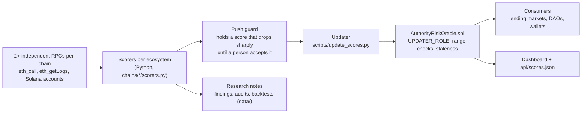

<p align="center">
  
</p>

<h1 align="center">Authority Risk Oracle</h1>

<p align="center"><b>Who can really move a DeFi protocol's funds? An on-chain oracle that answers, for 10 ecosystems, in one call any contract can make.</b></p>

<p align="center">
  <a href="LICENSE"></a>
  <a href=".github/workflows/test.yml"></a>
  
  
  
</p>

<p align="center">
  <a href="dashboard/index.html">Dashboard</a> ·
  <a href="#deployed-oracles">Deployed oracles</a> ·
  <a href="METHODOLOGY.md">Methodology</a> ·
  <a href="#read-a-score-from-a-contract">Integrate</a> ·
  <a href="docs/LANDSCAPE.md">How it compares</a> ·
  <a href="docs/OPERATIONS.md">Operate it</a>
</p>

Built for Colosseum's [Crypto World's Fair](https://colosseum.com/worldsfair) hackathon.

Most DeFi exploits are not code bugs. They are one admin key, one thin multisig, or one missing timelock. Risk providers
that look at this are paid by the protocols they rate, or sell a closed dashboard. This project computes the answer
independently, from public chain state, and **publishes it on-chain**, so a lending market, a DAO or a wallet can read it
and act on it without trusting anyone's website.

- **Five sub-scores per protocol**: admin-key concentration, multisig strength, timelock delay, oracle-signer authority
  and shared signers across protocols (0 = one bare key can do anything, 100 = no unchecked power found).
- **Two view functions**: `getScore(address)` and `isStale(address)`. A consumer contract can freeze collateral behind a weak
  authority and refuse a stale read outright ([`ExampleConsumer.sol`](src/ExampleConsumer.sol) does exactly that).
- **Every number is re-derived live** from two or more independent RPCs on every run, never cached. The methodology states
  what the oracle cannot see, next to what it can.

## Try it in 60 seconds

**1. Read a score, no install beyond [Foundry](https://getfoundry.sh)** (Robinhood Chain testnet, target: a tracked Uniswap v3 factory):

```bash
cast call 0x9BF45734D09bC7CA39238e767B2af9AAc62a7f52 \
  "getScore(address)(uint8,uint8,uint8,uint8,uint8,uint8,uint64,bytes32)" \
  0x1f7d7550B1b028f7571E69A784071F0205FD2EfA \
  --rpc-url https://rpc.testnet.chain.robinhood.com/rpc
# adminKey, multisig, timelock, oracleAuthority, crossExposure, composite, lastUpdated, methodologyHash
# 80, 100, 75, 100, 80, 85, 1790408560, 0xf2606acd...   (read live on 2026-10-06)
```

**2. Open the dashboard**: [`dashboard/index.html`](dashboard/index.html) is a single file with no backend. It reads every deployed
oracle live from your browser with raw `eth_call`, and has a calculator ("what would a 3-of-6 Safe score?") that places a
multisig among the published targets and the configurations of documented incidents.

**3. Pull the whole table as JSON**, with the transaction that produced it so you can cross-check it:

```bash
curl -s https://raw.githubusercontent.com/RealSpap/authority-risk-oracle-showcase/main/api/scores.json | jq '.txHash, (.scores | length)'
```

**4. Ask a question the score alone does not answer** (read-only, public RPC, no key):

```bash
pip install -r scripts/requirements.txt
python3 scripts/who_controls.py --top 20          # the most connected signers across every tracked protocol
python3 scripts/incident_exposure.py              # how many targets score at or below the multisig behind a documented incident
```

## What it scores

| Sub-score | The question it answers | Worst case |
|---|---|---|
| `adminKeyScore` | Who holds the upgrade / admin authority: a bare key, a Safe, a governance system? | one EOA |
| `multisigScore` | If a multisig: how many signers must agree, out of how many? | 1-of-N |
| `timelockScore` | Is there an enforced delay between a queued action and its effect? | no delay |
| `oracleAuthorityScore` | Who can change the prices the target reports or reads? | one price key |
| `crossExposureScore` | Does the same committee also control another tracked protocol? | shared across chains |

`compositeScore = floor(0.4 * admin + 0.3 * multisig + 0.3 * timelock + 0.5)`. The last two scores are published next to the
composite and deliberately not folded into it: a consumer may weigh them differently. Full derivation, inputs and
limits: [`METHODOLOGY.md`](METHODOLOGY.md).

**New in this release: the price path.** A lending market is only as safe as whoever can move the price it reads. The scorers now
walk each market's price sources one hop upstream (Chainlink proxies, rate providers, Chronicle and Pyth feeds, Morpho and Euler
oracles) and score the weakest controller among the paths that carry at least 1% of the market's supply, with timelocks, DAO
windows and code-bounded levers handled explicitly. It covers Aave V3 and its forks, Compound V3, Morpho V1 and V2, Euler V2,
Fluid, Dolomite, Moonwell, Radiant, GMX and Kamino and Jupiter Lend on Solana. Details and the live results:
[`METHODOLOGY.md`](METHODOLOGY.md#oracleauthorityscore-for-price-consumers).

## Deployed oracles

Read live on 2026-10-06 with `python3 scripts/live_target_counts.py` (`trackedTargetsCount()` on each oracle). 179 targets on 9 on-chain oracles,
plus 6 Zcash targets attested through on-chain commitments (Zcash has no contract VM).

| Ecosystem | Network | Oracle | Targets |
|---|---|---|---|
| Robinhood Chain | Testnet, chain 46630 | [`0x9BF4...7f52`](https://explorer.testnet.chain.robinhood.com/address/0x9BF45734D09bC7CA39238e767B2af9AAc62a7f52) | 63 |
| Ethereum L1 | Sepolia, chain 11155111 | [`0xB6F8...f906`](https://sepolia.etherscan.io/address/0xB6F8474ccC71AF477c31c2DF663B3942ddfbf906) | 25 |
| Arbitrum | Sepolia, chain 421614 | [`0x5084...8720`](https://sepolia.arbiscan.io/address/0x50840a7667baEa9D05ad4ae3dCeb384724b58720) | 13 |
| Base | Sepolia, chain 84532 | [`0x5084...8720`](https://sepolia.basescan.org/address/0x50840a7667baEa9D05ad4ae3dCeb384724b58720) | 13 |
| Tempo | Moderato, chain 42431 | [`0x5084...8720`](https://explore.testnet.tempo.xyz/address/0x50840a7667baEa9D05ad4ae3dCeb384724b58720) | 14 |
| Plasma | Testnet, chain 9746 | [`0x5084...8720`](https://testnet.plasmascan.to/address/0x50840a7667baEa9D05ad4ae3dCeb384724b58720) | 9 |
| Monad | Testnet, chain 10143 | [`0x5084...8720`](https://testnet.monadvision.com/address/0x50840a7667baEa9D05ad4ae3dCeb384724b58720) | 9 |
| Hyperliquid | HyperEVM testnet, chain 998 | `0x5084...8720` (no public explorer for this network) | 15 |
| Solana | Devnet, native Anchor program | [`5VhiTA...Yh4W`](https://explorer.solana.com/address/5VhiTAGLEViGgajhxPbzdWz7WLUAiRy42DY6qi6tYh4W?cluster=devnet) | 18 |
| Zcash | Testnet, no contract | [latest OP_RETURN commitment](https://testnet.cipherscan.app/tx/462de12bf72e5e635a1feed4a4cedb02c03f17745bd15176787f8f5f8fcd701c) | 6 attested |

The seven EVM oracles at `0x5084...8720` share one address by construction (the same deployer was at nonce 0 on each chain).
The targets are real mainnet protocols; the oracles that publish their scores run on testnets while the stack is validated.

## Read a score from a contract

```solidity
interface IAuthorityRiskOracle {
    struct AuthorityScore {
        uint8 adminKeyScore; uint8 multisigScore; uint8 timelockScore;
        uint8 oracleAuthorityScore; uint8 crossExposureScore; uint8 compositeScore;
        uint64 lastUpdated; bytes32 methodologyHash;
    }
    function getScore(address target) external view returns (AuthorityScore memory);
    function isStale(address target) external view returns (bool);
}

// in your lending market
IAuthorityRiskOracle.AuthorityScore memory s = oracle.getScore(collateralProtocol);
require(!oracle.isStale(collateralProtocol), "authority score stale");   // an old score is no score
uint256 factorBps = s.compositeScore < 20 ? 0 : (uint256(s.compositeScore) * maxFactorBps) / 100;
```

A fuller consumer, with its tests, is [`src/ExampleConsumer.sol`](src/ExampleConsumer.sol). Only an address holding `UPDATER_ROLE`
can write; every sub-score is range-checked on-chain (`ScoreOutOfRange`), a gap found by this project's own review of its contract
against the LlamaGuard pattern ([`data/contract_review_2026-09-17-llamaguard-comparison.md`](data/contract_review_2026-09-17-llamaguard-comparison.md)).

## How it works



1. **Score**: each ecosystem's scorer re-derives every target from live chain state (owners, thresholds, modules, proxy admins,
   timelock delays, price sources), with the second RPC as a cross-check.
2. **Guard**: a push that lowers a score by more than 15 points, or that follows a read that could not be completed, is held until
   a person looks at it. An unreadable source is never reported as safe.
3. **Publish**: the updater writes a batch on-chain with a `methodologyHash` derived from the code that produced it
   (`scripts/lib/methodology.py`), so a consumer can tell a scorer fix from a real change in the target's keys.
4. **Read**: any contract calls `getScore`; the dashboard and `api/scores.json` do the same for people.

## What is verified on-chain, and what is not

| Claim | Where it lives | How to check it |
|---|---|---|
| The scores a consumer reads | contract storage | `getScore(target)` |
| Who may write a score | `UPDATER_ROLE` | `hasRole(UPDATER_ROLE, address)` |
| A score is not too old | contract | `isStale(target)` |
| Which code produced a batch | `methodologyHash` | recompute with `python3 scripts/lib/methodology.py <ecosystem> --label <label>` |
| Zcash scores | OP_RETURN commitments on Zcash testnet | [`chains/zcash/`](chains/zcash/) |
| The inputs (keys, thresholds, delays) | public chain state, re-read at scoring time | each scorer and every dated audit in `data/` |
| The classification rules | documented heuristics, tested | [`METHODOLOGY.md`](METHODOLOGY.md) |

## Evidence

- **Backtests on real incidents**: the formula applied to the configuration behind Drift ([`data/backtest_2026-09-17-drift-protocol-security-council-compromise.md`](data/backtest_2026-09-17-drift-protocol-security-council-compromise.md)),
  Wasabi ([`data/backtest_2026-09-17-wasabi-protocol.md`](data/backtest_2026-09-17-wasabi-protocol.md)) and Solend ([`data/backtest_2026-09-17-solend-governance-emergency-powers.md`](data/backtest_2026-09-17-solend-governance-emergency-powers.md)).
- **Adversarial review and published corrections**: every batch is re-checked by a separate pass told to refute it, and
  errors are published as `data/correction_*.md` rather than edited away.
- **2,800+ unit tests** (Python, offline) plus the Solidity suite in `test/`. Run them with the commands below.
- **Read-only watch tools** that answer what a score alone does not (stale oracles, Safe changes, queued timelock operations,
  signer-kind changes, TVL coverage): [`docs/OPERATIONS.md`](docs/OPERATIONS.md).

## How it compares

| | On-chain, composable | Independent of the rated protocol | Authority risk specifically |
|---|---|---|---|
| Hypernative, Blockaid | no, closed dashboard | yes | partial |
| Gauntlet, Chaos Labs, LlamaRisk | LlamaGuard PT is on-chain, for collateral risk | no, paid by the protocol rated | no |
| [SolGov](https://solgov.xyz) | no, a website | yes | yes, Solana only |
| [Forta Risk Graph](https://github.com/forta-network/forta-risk-skills) | no, an OAuth-gated MCP server | yes | yes, Ethereum mainnet only, and deliberately no scores |
| DeFiSafety, DeFiScan | no, static reports (DeFiScan stopped in 2026) | yes | partial |
| **This project** | **yes, `getScore` / `isStale`** | **yes** | **yes, across 10 ecosystems** |

The longer comparison, including what SolGov and LlamaRisk do better and where this project is still thin, is in
[`docs/LANDSCAPE.md`](docs/LANDSCAPE.md). The business case is in [`BUSINESS.md`](BUSINESS.md).

## Limitations, stated plainly

- **Testnet publication.** The oracles run on testnets with one updater key while the stack is validated; the targets are mainnet
  protocols. A mainnet deployment would move the updater to a multisig first.
- **Trust in the updater.** A consumer trusts whoever holds `UPDATER_ROLE` to publish what the scorers computed. The
  `methodologyHash`, the public code and the push guard make a bad push detectable, not impossible.
- **Coverage is partial.** 179 targets is a fraction of DeFi TVL; `python3 scripts/check_tvl_coverage.py` measures it per ecosystem.
- **Heuristics.** Classifying an account (EOA, Safe, DAO, timelock) and bounding a lever are judgments, documented and tested, not proofs.
- **Freshness is not continuous.** Scores are pushed on a cadence; `isStale` tells a consumer when to stop trusting one.
- **The contract has had no external audit.** It is small (see [`src/`](src/)) and was reviewed against the LlamaGuard pattern by this project itself.

## Built during the hackathon, and what came before

The repository started on 2026-09-15 as a private working repository; the public history here is a sequence of dated snapshots of that
work (the earliest days are folded into the first snapshots, and a few findings still under responsible disclosure are left out). The scoring logic reuses
classification code from two earlier research programs by the same author:
[`multisig-overlap`](https://github.com/RealSpap/multisig-overlap-showcase) and
[`defi-admin-key-risk`](https://github.com/RealSpap/defi-admin-key-risk-showcase). Everything in this repository (contract, ten
ecosystems' scorers, updater, push guard, dashboard, tests) was built in the hackathon window.
`methodologyHash` is derived from the bytes of the scorer files, so the digest of this public copy differs from hashes published by
pushes made from the working repository; a push made from a commit of this repository publishes this repository's digest.

## Repository map

| Path | What is in it |
|---|---|
| [`src/`](src/), [`test/`](test/), [`script/`](script/) | the oracle contract, the example consumer, Foundry tests, the deploy script |
| [`chains/`](chains/) | one folder per ecosystem: scorers, deploy records, dated audits, methodology notes ([map](chains/README.md)) |
| [`scripts/`](scripts/) | the updater, the push guard, shared libraries (`scripts/lib/`), watch tools and their tests |
| [`dashboard/`](dashboard/), [`api/`](api/) | the single-file dashboard and the JSON snapshot of the last push |
| [`data/`](data/) | findings, corrections, backtests and snapshots ([index](data/README.md)) |
| [`METHODOLOGY.md`](METHODOLOGY.md), [`CHANGELOG.md`](CHANGELOG.md), [`BUSINESS.md`](BUSINESS.md) | how scores are derived, the dated history, the market case |
| [`docs/`](docs/) | [landscape](docs/LANDSCAPE.md) and [operations](docs/OPERATIONS.md) |

## Develop and test

```bash
forge install foundry-rs/forge-std OpenZeppelin/openzeppelin-contracts --no-git
forge test

pip install -r scripts/requirements.txt
python3 -m unittest discover -s scripts/lib/tests
python3 -m unittest discover -s scripts/tests
```

Deploying needs `PRIVATE_KEY` in the environment, never committed: `forge script script/Deploy.s.sol --rpc-url robinhood --broadcast`.
Every deploy script defaults to a dry run and refuses a chain whose `eth_chainId` is not the expected one.
Report a vulnerability as described in [`SECURITY.md`](SECURITY.md).

## License

[MIT](LICENSE).
